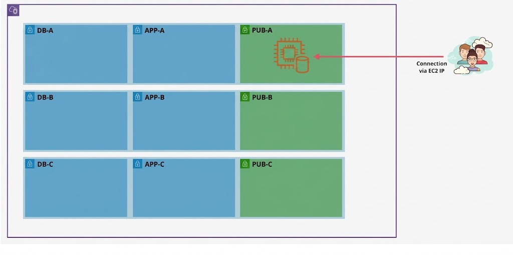
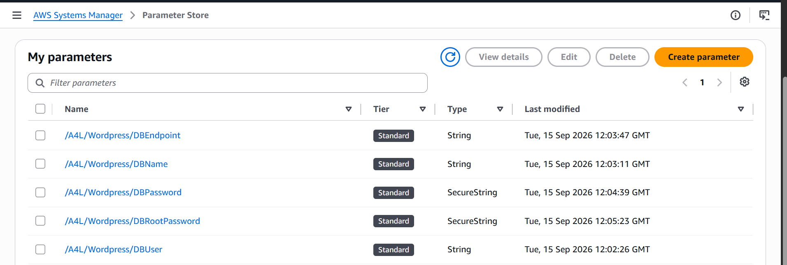
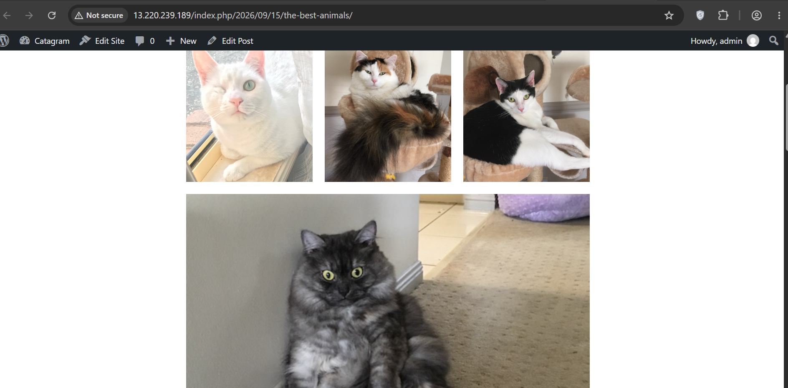

# 🏗️ Stage 1: Baseline Monolithic WordPress Deployment & Failure Analysis

---

## 📌 Executive Summary

In **Stage 1**, we deploy the baseline monolithic architecture for a production-like WordPress application. The entire stack—web server (**Apache HTTP Server**), runtime engine (**PHP 8.2**), relational database (**MariaDB 10.5**), and local media uploads—is hosted on a single **Amazon EC2 instance** inside a public subnet (`sn-pub-A`).

This implementation serves as the foundational **"Day 0" anti-pattern deployment**. It demonstrates operational bottlenecks, configuration management via AWS native services, and critical **Single Point of Failure (SPOF)** vulnerabilities before migrating towards an automated, decoupled, and fault-tolerant architecture.

---

## 🗺️ High-Level Architecture

The environment utilizes a pre-configured, multi-tier VPC spanning 3 Availability Zones (`us-east-1a`, `us-east-1b`, `us-east-1c`). In this initial phase, only a single public subnet is utilized, while the remaining isolated application and database subnets remain idle.



### 🧱 Core Architecture Characteristics

- **Monolithic Coupling:** Web presentation, compute execution, database transactions, and file storage reside on the same OS filesystem and EBS volume.
- **Direct Client Ingress:** End-users communicate directly with the EC2 public IP without an intermediate abstraction layer (e.g., Application Load Balancer or CDN).
- **Stateful EC2 Pattern:** Scaling the instance horizontally is impossible without data desynchronization and split-brain states.

---

## ⚙️ Infrastructure Specifications

### 1. 🌐 Networking & Placement

| Parameter | Configuration Value | Architectural Context |
| :--- | :--- | :--- |
| **VPC** | `A4LVPC` (`10.16.0.0/16`) | Dual-stack enabled (IPv4 + Amazon-allocated IPv6 CIDR) |
| **Subnet** | `sn-pub-A` (`10.16.48.0/20`) | Multi-AZ Public Subnet attached to `A4L-IGW` |
| **Availability Zone** | `us-east-1a` | Initial single-AZ blast radius |
| **Public Addressing** | Auto-assign Public IPv4 & IPv6 | Direct Internet routability enabled |

### 2. 🖥️ Compute & Identity

| Parameter | Configuration Value | Security & Operational Intent |
| :--- | :--- | :--- |
| **Instance Name** | `wordpress-ec2-monolith` | Canonical identifier for manual baseline |
| **AMI** | Amazon Linux 2023 (AL2023) | Modern systemd-based Linux distribution (`x86_64`) |
| **Instance Type** | `t3.micro` | 2 vCPU, 1 GiB RAM (Free-Tier Eligible) |
| **Key Pair** | *Proceed without a KeyPair* | Eliminates long-lived SSH credentials (`Port 22`) |
| **IAM Instance Profile** | `A4LVPC-WordpressInstanceProfile` | Grants temporary AWS STS credentials to the instance |


### 3. 🛡️ Security Group Ingress & Egress (`A4LVPC-SGWordpress`)

**Inbound Rules:**

- `HTTP` (TCP Port 80) → `0.0.0.0/0` (Allows public HTTP web traffic from anywhere).

**Outbound Rules:**

- `All Traffic` (All Protocols, All Ports) → `0.0.0.0/0` (Required for package manager updates, downloading WordPress core, and communicating with AWS Systems Manager endpoints).

---

## 🔐 Configuration Management: AWS SSM Parameter Store

To adhere to the AWS Well-Architected Security Pillar, zero plaintext credentials are embedded within deployment scripts or configuration files. Secrets and environment attributes are externalized into **AWS Systems Manager (SSM) Parameter Store**.



### 📋 Parameter Store Registry

| Parameter Key Name | Type | Tier | Stored Value | Functional Description |
| :--- | :--- | :--- | :--- | :--- |
| `/A4L/Wordpress/DBUser` | `String` | Standard | `a4lwordpressuser` | Dedicated database user for WordPress application |
| `/A4L/Wordpress/DBName` | `String` | Standard | `a4lwordpressdb` | Primary MySQL database schema name |
| `/A4L/Wordpress/DBEndpoint` | `String` | Standard | `localhost` | Database network target (local loopback interface) |
| `/A4L/Wordpress/DBPassword` | `SecureString` | Standard | `4n1m4l54L1f3` | KMS-encrypted database user password (`alias/aws/ssm`) |
| `/A4L/Wordpress/DBRootPassword` | `SecureString` | Standard | `4n1m4l54L1f3` | KMS-encrypted administrative password for MariaDB root |

---

## 💻 Step-by-Step Manual Installation Guide

### Phase 1: Establish Secure Shell via AWS Systems Manager

Instead of traditional SSH bastion hosts or exposed management ports, we authenticate via **SSM Session Manager**:

1. Open the **Amazon EC2 Console** at `us-east-1`.
2. Select the `wordpress-ec2-monolith` instance.
3. Click **Connect** → Select **SSM Session Manager** → Click **Connect**.
4. Elevate session privileges to superuser and enter a clean working directory:

   ```bash
   # Switch to root environment
   sudo bash

   # Switch to the root home directory
   cd

   # Clear terminal screen
   clear
   ```

---

### Phase 2: Dynamic Secrets Ingestion from AWS SSM

Execute the following commands to retrieve parameters securely using the AWS CLI and strip JSON formatting:

```bash
# Retrieve encrypted database user credentials
DBPassword=$(aws ssm get-parameters --region us-east-1 --names /A4L/Wordpress/DBPassword --with-decryption --query Parameters[0].Value)
DBPassword=$(echo "$DBPassword" | sed -e 's/^"//' -e 's/"$//')

# Retrieve encrypted database root credentials
DBRootPassword=$(aws ssm get-parameters --region us-east-1 --names /A4L/Wordpress/DBRootPassword --with-decryption --query Parameters[0].Value)
DBRootPassword=$(echo "$DBRootPassword" | sed -e 's/^"//' -e 's/"$//')

# Retrieve application database user
DBUser=$(aws ssm get-parameters --region us-east-1 --names /A4L/Wordpress/DBUser --query Parameters[0].Value)
DBUser=$(echo "$DBUser" | sed -e 's/^"//' -e 's/"$//')

# Retrieve target database schema name
DBName=$(aws ssm get-parameters --region us-east-1 --names /A4L/Wordpress/DBName --query Parameters[0].Value)
DBName=$(echo "$DBName" | sed -e 's/^"//' -e 's/"$//')

# Retrieve database endpoint address
DBEndpoint=$(aws ssm get-parameters --region us-east-1 --names /A4L/Wordpress/DBEndpoint --query Parameters[0].Value)
DBEndpoint=$(echo "$DBEndpoint" | sed -e 's/^"//' -e 's/"$//')
```

---

### Phase 3: Software Provisioning & Dependencies

Update OS package repositories and install Apache HTTP Server, MariaDB 10.5 server, PHP extensions, and the required GD graphics library:

```bash
# 1. Update OS packages
sudo dnf -y update

# 2. Install LAMP stack, stress testing tool, and PHP image libraries
sudo dnf install -y \
  wget \
  httpd \
  php-fpm \
  php-mysqli \
  php-mysqlnd \
  mariadb105-server \
  php-json \
  php \
  php-devel \
  php-gd \
  stress

# 3. Enable and start system services immediately
sudo systemctl enable --now httpd
sudo systemctl enable --now mariadb
sudo systemctl enable --now php-fpm

# 4. Set the MariaDB root administrative password
sudo mysqladmin -u root password "$DBRootPassword"
```

---

### Phase 4: WordPress Deployment & Configuration

Download the official WordPress tarball, extract it to the Apache document root, configure database parameters, and apply the correct Linux file permissions:

```bash
# 1. Download and extract WordPress core
sudo wget https://wordpress.org/latest.tar.gz -P /var/www/html
cd /var/www/html
sudo tar -zxvf latest.tar.gz
sudo cp -rvf wordpress/* .
sudo rm -rf wordpress latest.tar.gz

# 2. Generate and configure wp-config.php with SSM variables
sudo cp ./wp-config-sample.php ./wp-config.php
sudo sed -i "s/'database_name_here'/'$DBName'/g" wp-config.php
sudo sed -i "s/'username_here'/'$DBUser'/g" wp-config.php
sudo sed -i "s/'password_here'/'$DBPassword'/g" wp-config.php
sudo sed -i "s/'localhost'/'$DBEndpoint'/g" wp-config.php

# 3. Apply group permissions and ownership for Apache web server
sudo usermod -a -G apache ec2-user
sudo chown -R ec2-user:apache /var/www
sudo chmod 2775 /var/www
sudo find /var/www -type d -exec chmod 2775 {} \;
sudo find /var/www -type f -exec chmod 0664 {} \;
```

---

### Phase 5: Database Schema Provisioning

Automate database and grant table creation using a temporary SQL definition file:

```bash
# 1. Generate SQL migration script
sudo sh -c "echo \"CREATE DATABASE $DBName;\" >> /tmp/db.setup"
sudo sh -c "echo \"CREATE USER '$DBUser'@'localhost' IDENTIFIED BY '$DBPassword';\" >> /tmp/db.setup"
sudo sh -c "echo \"GRANT ALL ON $DBName.* TO '$DBUser'@'localhost';\" >> /tmp/db.setup"
sudo sh -c "echo 'FLUSH PRIVILEGES;' >> /tmp/db.setup"

# 2. Execute SQL payload against local MariaDB instance
sudo mysql -u root --password="$DBRootPassword" < /tmp/db.setup

# 3. Remove temporary setup file to prevent credential leakage
sudo rm -f /tmp/db.setup

# 4. Restart web service to finalize FastCGI integration
sudo systemctl restart httpd php-fpm
```
---

## 🚀 Verification & Application Testing

### 1. 🌐 Initial Web Installation

1. Navigate to the **Amazon EC2 Console** (`us-east-1`).
2. Select the `wordpress-ec2-monolith` instance and copy the **Public IPv4 address**.
3. Open a web browser tab: `http://<EC2_PUBLIC_IPV4>/`.
4. Complete the initial installation wizard:
   - **Site Title:** `Catagram`
   - **Username:** `admin`
   - **Password:** `4n1m4l54L1f3`
   - **Email:** *(Configured administrative contact)*

### 2. 📝 Content Creation & Media Persistence Test

- Navigate to **Posts** ➡️ Delete the default `Hello World!` post.
- Create a new post:
  - **Title:** `The Best Animal(s)!`
  - **Block:** Add a `Gallery` block.
  - **Uploads:** Upload cat gallery images to test media handling and root volume I/O.
- Click **Publish** ➡️ View the published post.



---

## 🛠️ Engineering Challenges & Troubleshooting Log

During the manual deployment of Stage 1, two major technical hurdles were encountered and resolved.

### 📋 Stage 1 Incident Log

| Issue | Resolution Summary |
| :--- | :--- |
| **1. SSM Session Manager Failure** (`Not connected` state) | IAM Instance Profile was attached post-launch; the instance was rebooted to reinitialize credential acquisition and allow the SSM Agent to obtain valid instance credentials. |
| **2. Image Upload Error** (`Cannot generate responsive`) | Installed the missing `php-gd` extension and restarted the PHP-FPM / Apache services. |

### Incident 1: Systems Manager Session Authentication Drop

**Symptoms:** The AWS EC2 Console reported `Session Manager connection status: Not connected`, and the console logs recorded:

```text
SSM Agent unable to acquire credentials: no valid credentials could be retrieved for ec2 identity...
```

**Root Cause Analysis (RCA):**  
The IAM instance role `A4LVPC-WordpressInstanceProfile` was associated with the instance **after** system boot. The SSM Agent could not initially obtain valid credentials through the EC2 Instance Metadata Service (IMDS).

**Remediation:**

1. Re-verified IAM role attachment via **EC2 Console** ➡️ **Actions** ➡️ **Security** ➡️ **Modify IAM role**.
2. Executed a **Reboot instance** to force the `amazon-ssm-agent` to retry credential acquisition through IMDS.

### Incident 2: Media Processing Failure on Gallery Upload

**Symptoms:** Uploading JPEG/PNG images within the WordPress Gutenberg editor generated the following error:

```text
The web server cannot generate responsive image sizes for this image. Convert it to JPEG or PNG before uploading.
```

**Root Cause Analysis (RCA):**  
WordPress relies on image-processing capabilities provided by PHP extensions such as **GD** or **ImageMagick** to crop, scale, and generate intermediate image sizes such as `thumbnail`, `medium`, and `large`. The baseline installation omitted the `php-gd` package.

**Remediation:**

Installed the missing PHP extension and restarted PHP-FPM and Apache:

```bash
sudo dnf install -y php-gd
sudo systemctl restart php-fpm httpd
```

---

## 💥 Architectural Failure Analysis: The "Restart Disaster" (Post-Mortem)

To evaluate system resilience, the EC2 instance was subjected to a manual lifecycle failure simulation:

```text
[Running Instance: 13.220.239.189]
               │
               ▼ (Stop Instance)
        [State: Stopped]
               │
               ▼ (Start Instance)
[New Instance State: Running] ────► New Public IPv4 Allocated: 54.x.x.x
                                              │
                                              ▼
                    ┌──────────────────────────────────────────────────┐
                    │ Database entries still point to 13.220.239.189 │
                    │ ❌ CSS Stylesheets: 404 Not Found                │
                    │ ❌ Image Media: Broken Links                     │
                    │ ❌ Admin Dashboard: Inaccessible / Redirect Loop │
                    └──────────────────────────────────────────────────┘
```

### 🔍 Key Failure Findings

1. **Dynamic IP Mutation:**  
   AWS public IPv4 addresses assigned to a standard EC2 public interface are ephemeral. When an instance is stopped and then started without an **Elastic IP (EIP)** or a DNS abstraction layer, a different public IPv4 address may be assigned.

2. **Hardcoded Database Entities:**  
   WordPress stores absolute site URLs such as `http://<EC2-IP>/` in the `wp_options` table, including the `siteurl` and `home` values. WordPress content can also contain references to the previous URL.

3. **Cascading Asset Loss:**  
   When accessing the application through the new IP address, the browser may still request stylesheets, JavaScript resources, and uploaded media using URLs referencing the previous IP address, resulting in broken assets and application behavior.

4. **Stateful Coupling & Single Point of Failure (SPOF):**
   - The single EC2 instance hosts the **web application, database, and local media**, creating a tightly coupled architecture.
   - If the instance fails and no backups or recovery mechanism exist, the locally stored **database and media data** are at risk.
   - Horizontal scaling is not practical because application state, database state, and uploaded files are all tied to the same instance.

---

## 🎯 Transition to Stage 2: Architectural Evolution Plan

Stage 1 successfully establishes our baseline and documents the critical pitfalls of a monolithic deployment. In **Stage 2**, we begin refactoring toward a cloud-native, decoupled, and fault-tolerant architecture.

- [ ] **Automated Provisioning:** Replace manual command entry with automated bootstrap scripts embedded in **EC2 User Data** and **Launch Templates**.
- [ ] **Database Decoupling:** Migrate the local MariaDB database to **Amazon RDS Multi-AZ** in the private database subnets (`sn-db-A`, `sn-db-B`, `sn-db-C`).
- [ ] **Elastic Shared Storage:** Migrate `/var/www/html/wp-content/uploads` to **Amazon EFS** to enable stateless compute nodes.
- [ ] **High Availability & Scalability:** Introduce an **Application Load Balancer (ALB)** and **Auto Scaling Group (ASG)** across multiple Availability Zones to eliminate the single-instance SPOF.

---

## 📤 Documentation Commit & Push

After completing and validating the Stage 1 documentation, add the updated documentation directory to Git and push it to GitHub:

