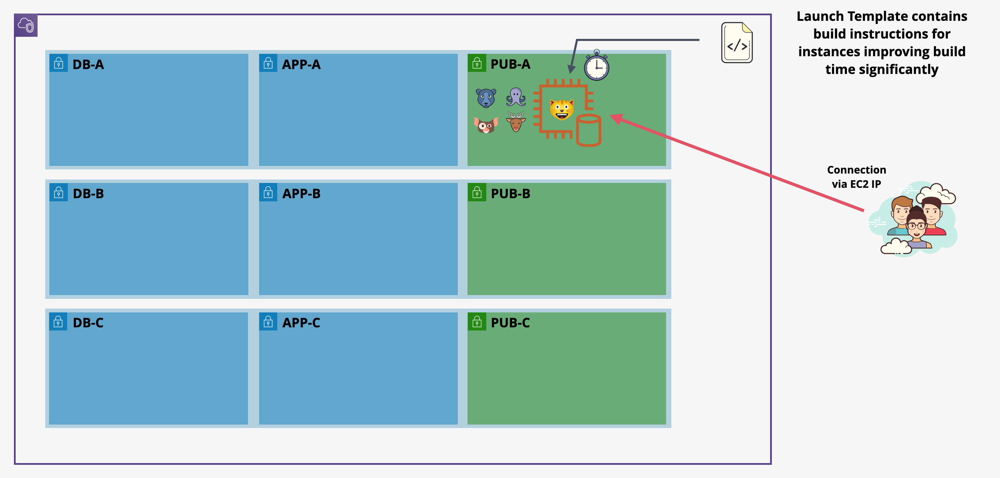
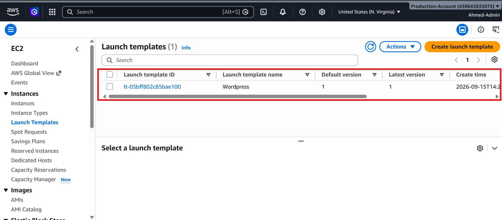
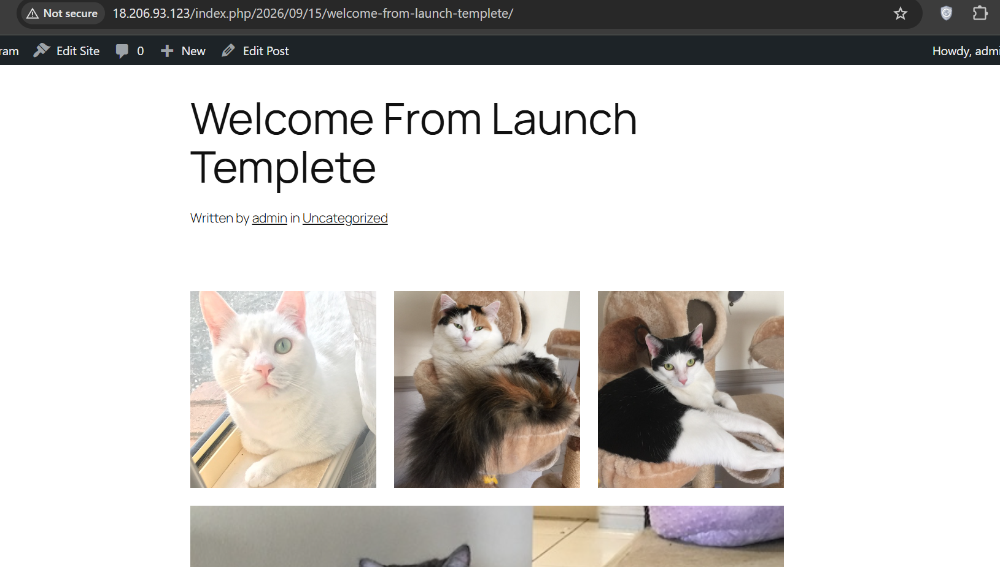

# ⚡ Stage 2: Automated WordPress Provisioning via EC2 Launch Templates

---

## 📌 Executive Summary

In **Stage 2**, the architecture transitions from interactive shell provisioning to declarative automation. We engineer an **Amazon EC2 Launch Template** that encapsulates compute sizing, IAM instance credentials, network isolation rules, and an automated initialization payload (**User Data**).

Although the database and application tier remain colocated on a single EC2 instance inside a public subnet (`sn-pub-A`), this stage eliminates manual execution latency and establishes the prerequisite foundation for **Auto Scaling Groups (ASG)** and self-healing infrastructure.

---

## 🗺️ Architectural Topology

The compute and data layer remain consolidated within a single instance. The key milestone achieved is shifting from human-driven command entry to an automated, template-driven build.



### 🧱 Architectural Characteristics

- **Bootstrap Delivery:** EC2 initializes with an embedded Bash payload executed unattended via `cloud-init` at first boot.
- **Centralized Configuration:** Dynamic database credentials continue to resolve securely from **AWS Systems Manager Parameter Store** at startup.
- **Pre-requisite for Elasticity:** Eliminates manual terminal interventions (`SSH` / SSM CLI), allowing replacement compute capacity to initialize consistently.

---

## ⚙️ Launch Template Configuration Matrix

The template was provisioned with the following parameters to ensure strict adherence to AWS Auto Scaling guidance:

| Configuration Area | Directive / Parameter | Architectural Justification |
| :--- | :--- | :--- |
| **Template Name** | `Wordpress` | Canonical identifier for the core WordPress fleet |
| **Template Description** | `Single server DB and App` | Identifies single-tier baseline before separation |
| **Auto Scaling Guidance** | **Enabled** (`Provide guidance...`) | Enforces validation rules suitable for Auto Scaling |
| **Base AMI** | Amazon Linux 2023 (AL2023) | Modern systemd platform with native AWS CLI v2 |
| **Architecture** | 64-bit (`x86_64`) | Compatible with standard compute sizing |
| **Instance Type** | `t3.micro` (or `t2.micro`) | 2 vCPUs, 1 GiB RAM |
| **Key Pair** | *Proceed without a key pair* | Eliminates static key management; relies on SSM |
| **Security Groups** | `A4LVPC-SGWordpress` | Grants ingress on HTTP Port 80, egress on all ports |
| **IAM Instance Profile** | `A4LVPC-WordpressInstanceProfile` | Grants role assumption for SSM & Parameter Store |
| **Credit Specification** | Standard | Baseline burst behavior without unexpected charges |



---

## 📜 Automated User Data Bootstrap Payload

The following Bash initialization payload was integrated into the Launch Template's **Advanced Details ➡️ User Data** field:

```bash
#!/bin/bash -xe

# ==============================================================================
# Dynamic Secrets Ingestion via AWS SSM Parameter Store
# ==============================================================================

DBPassword=$(aws ssm get-parameters \
  --region us-east-1 \
  --names /A4L/Wordpress/DBPassword \
  --with-decryption \
  --query Parameters[0].Value)

DBPassword=$(echo "$DBPassword" | sed -e 's/^"//' -e 's/"$//')

DBRootPassword=$(aws ssm get-parameters \
  --region us-east-1 \
  --names /A4L/Wordpress/DBRootPassword \
  --with-decryption \
  --query Parameters[0].Value)

DBRootPassword=$(echo "$DBRootPassword" | sed -e 's/^"//' -e 's/"$//')

DBUser=$(aws ssm get-parameters \
  --region us-east-1 \
  --names /A4L/Wordpress/DBUser \
  --query Parameters[0].Value)

DBUser=$(echo "$DBUser" | sed -e 's/^"//' -e 's/"$//')

DBName=$(aws ssm get-parameters \
  --region us-east-1 \
  --names /A4L/Wordpress/DBName \
  --query Parameters[0].Value)

DBName=$(echo "$DBName" | sed -e 's/^"//' -e 's/"$//')

DBEndpoint=$(aws ssm get-parameters \
  --region us-east-1 \
  --names /A4L/Wordpress/DBEndpoint \
  --query Parameters[0].Value)

DBEndpoint=$(echo "$DBEndpoint" | sed -e 's/^"//' -e 's/"$//')

# ==============================================================================
# System Dependencies & LAMP Stack Installation
# ==============================================================================

dnf -y update

dnf install -y \
  wget \
  php-mysqlnd \
  httpd \
  php-fpm \
  php-mysqli \
  mariadb105-server \
  php-json \
  php \
  php-devel \
  php-gd \
  stress

systemctl enable --now httpd
systemctl enable --now mariadb
systemctl enable --now php-fpm

mysqladmin -u root password "$DBRootPassword"

# ==============================================================================
# Application Ingestion & Configuration
# ==============================================================================

wget https://wordpress.org/latest.tar.gz -P /var/www/html

cd /var/www/html

tar -zxvf latest.tar.gz
cp -rvf wordpress/* .
rm -rf wordpress latest.tar.gz

cp ./wp-config-sample.php ./wp-config.php

sed -i "s/'database_name_here'/'$DBName'/g" wp-config.php
sed -i "s/'username_here'/'$DBUser'/g" wp-config.php
sed -i "s/'password_here'/'$DBPassword'/g" wp-config.php
sed -i "s/'localhost'/'$DBEndpoint'/g" wp-config.php

# ==============================================================================
# Permissions Hardening & Database Initialization
# ==============================================================================

usermod -a -G apache ec2-user

chown -R ec2-user:apache /var/www

chmod 2775 /var/www

find /var/www -type d -exec chmod 2775 {} \;
find /var/www -type f -exec chmod 0664 {} \;

cat > /tmp/db.setup << EOF
CREATE DATABASE $DBName;
CREATE USER '$DBUser'@'localhost' IDENTIFIED BY '$DBPassword';
GRANT ALL ON $DBName.* TO '$DBUser'@'localhost';
FLUSH PRIVILEGES;
EOF

mysql -u root --password="$DBRootPassword" < /tmp/db.setup

rm -f /tmp/db.setup
```

---

## 🚀 Provisioning & Smoke Testing

### 1. Provisioning Instance from Template

An instance was launched directly from the `Wordpress` Launch Template:

- **Instance Tag:** `Name = Wordpress-LT`
- **Subnet:** `sn-pub-A`
- **Key Pair:** *Proceed without a key pair*
- **Status Check Outcome:** Successfully reached `2/2 checks passed` with no manual SSH/SSM interaction required.


### 2. Functional Application Testing

- Accessed the allocated public IP address via HTTP: `http://18.206.93.123/`.
- Verified that the web server, PHP FastCGI, and MariaDB were running and operational.
- Completed the standard WordPress web installation:
  - **Site Title:** `Catagram`
  - **Admin Username:** `admin`
  - **Admin Password:** `4n1m4l54L1f3`
- Created and published a verification post titled **"Welcome From Launch Templete"** containing an image gallery to confirm upload processing.



> ⚠️ **Critical State Warning:** Do **NOT** terminate this instance (`Wordpress-LT`). It contains the baseline database records and content required for database migration in **Stage 3**.

---

## ⚖️ Architectural Audit: Resolved vs. Remaining Limitations

| Architecture Area | State & Remaining Vulnerabilities |
| :--- | :--- |
| **1. Build Process** | ✅ **RESOLVED:** Automated via Launch Template User Data |
| **2. Database Decoupling** | ❌ **UNRESOLVED:** Local MariaDB; cannot scale compute independently |
| **3. File System Resilience** | ❌ **UNRESOLVED:** Uploads reside on root EBS volume |
| **4. Ingress & Healing** | ❌ **UNRESOLVED:** Direct IP mapping; no ALB / health-based routing |
| **5. IP Mutability Risk** | ❌ **UNRESOLVED:** WordPress URL references can depend on the instance IP |

---

## 🎯 Next Milestone: Stage 3 Roadmap

In **Stage 3**, we address the database coupling problem:

1. Provision a managed **Amazon Aurora / Amazon RDS Multi-AZ** database within the isolated database subnets (`sn-db-A`, `sn-db-B`, `sn-db-C`).
2. Export the existing database using `mysqldump` from `Wordpress-LT`.
3. Restore the database into RDS.
4. Update the SSM Parameter `/A4L/Wordpress/DBEndpoint` with the new database endpoint.
5. Update the WordPress configuration to use the managed database.
6. Retire local MariaDB hosting from the application instance.

---

## 📂 Stage 2 User Data Script

The bootstrap script is also maintained separately for version control and reuse:

`aws-elastic-wordpress-evolution/scripts/stage2-userdata.sh`

The script contains the same automated provisioning logic used by the EC2 Launch Template.

---


