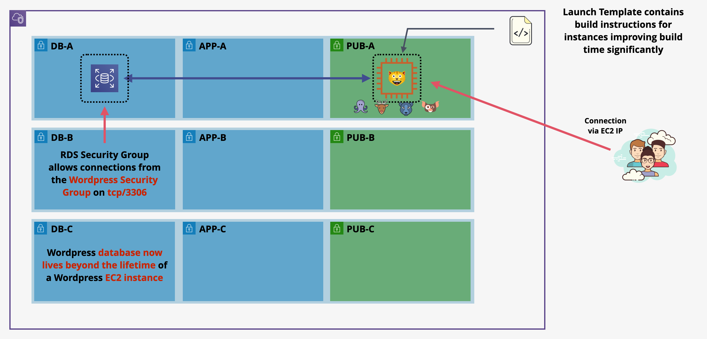
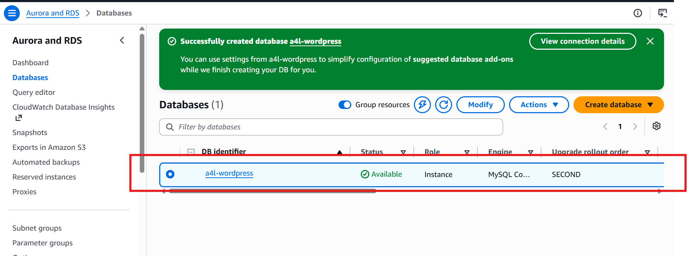
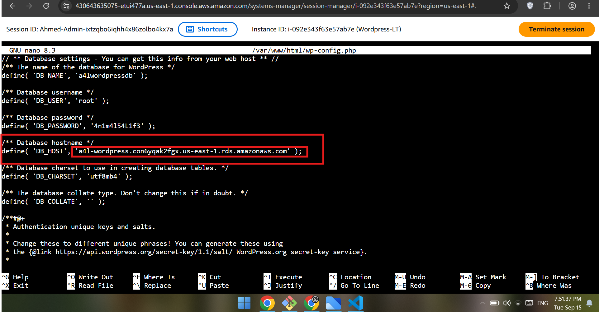
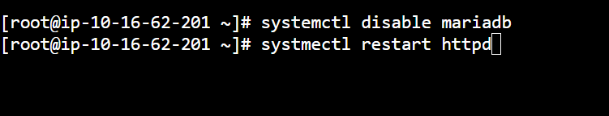
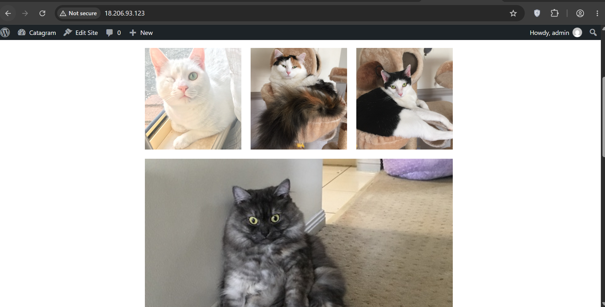

# 🗄️ Stage 3: Decoupling the Database Tier to Amazon RDS MySQL

---

## 📌 Executive Summary

In **Stage 3**, we break the monolithic architecture apart by decoupling the stateful relational database from the compute layer. We provision an **Amazon RDS for MySQL** instance isolated inside private database subnets and migrate the existing WordPress database from the local MariaDB engine.

By offloading persistent relational data from the EC2 instance, the database lifecycle is no longer tied to compute uptime. Compute instances become more disposable, paving the way for horizontal scaling and auto-recovery.

---

## 🗺️ Architectural Topology

The database functionality moves out of `sn-pub-A` into dedicated private database subnets managed by an **RDS DB Subnet Group**. The compute instance in the public subnet communicates with RDS over port `3306` using private network paths controlled by Security Groups.



### 🧱 Architectural Highlights

- **Private Network Isolation:** The managed database engine resides in private subnets without public IPv4 accessibility.
- **Granular Least Privilege:** Ingress on `TCP/3306` within `A4LVPC-SGDatabase` allows traffic originating from `A4LVPC-SGWordpress`.
- **State Decoupling:** EC2 instances can now terminate or scale without destroying the transactional WordPress database.
- **Managed Database Lifecycle:** RDS takes over database provisioning, patching, storage management, and database-level operations.

---

## ⚙️ RDS Infrastructure Configuration

### 1. Database Subnet Group Allocation

An RDS DB Subnet Group was provisioned spanning three distinct Availability Zones:

| Parameter | Configuration Value | Target Scope |
| :--- | :--- | :--- |
| **Subnet Group Name** | `wordpressrdssubnetgroup` | Dedicated WordPress database layer |
| **Target VPC** | `A4LVPC` | Project Virtual Private Cloud |
| **Subnet A** | `10.16.16.0/20` | `sn-db-A` (`us-east-1a`) |
| **Subnet B** | `10.16.80.0/20` | `sn-db-B` (`us-east-1b`) |
| **Subnet C** | `10.16.144.0/20` | `sn-db-C` (`us-east-1c`) |


### 2. Managed RDS Instance Provisioning

A single-AZ MySQL database instance was deployed within the subnet group:

| Configuration | Value |
| :--- | :--- |
| **Engine** | MySQL Community 8.0.32 |
| **DB Instance Identifier** | `a4l-wordpress` |
| **Instance Class** | `db.t3.micro` / `db.t2.micro` |
| **VPC & Subnet Group** | `A4LVPC` / `wordpressrdssubnetgroup` |
| **Public Accessibility** | **No** |
| **Security Group** | `A4LVPC-SGDatabase` |
| **Initial Database Name** | `a4lwordpressdb` |



---

## 💾 Database Migration & State Transfer

The migration was executed directly from the running `Wordpress-LT` compute node through **AWS Systems Manager Session Manager**.

### 1. Local Database Export

A complete SQL dump was generated from the local MariaDB database:

```bash
mysqldump -u "root" -p"4n1m4l54L1f3" "a4lwordpressdb" > /tmp/database.sql
```

### 2. Import into Amazon RDS

The dump was then imported into the provisioned RDS instance:

```bash
mysql \
  -h "a4l-wordpress.con6yqak2fgx.us-east-1.rds.amazonaws.com" \
  -u "root" \
  -p"4n1m4l54L1f3" \
  "a4lwordpressdb" < /tmp/database.sql
```


---

## 🔧 Application Cutover & Service Decommissioning

### 1. Updating WordPress Configuration

The WordPress database host directive in `wp-config.php` was repointed from `localhost` to the managed RDS endpoint:

```php
/** Database hostname */
define( 'DB_HOST', 'a4l-wordpress.con6yqak2fgx.us-east-1.rds.amazonaws.com' );
```



### 2. SSM Parameter Store Alignment

The centralized `/A4L/Wordpress/DBEndpoint` parameter in **AWS Systems Manager Parameter Store** was updated with the new RDS endpoint.

This ensures future EC2 instances retrieve the managed database endpoint dynamically during bootstrap instead of relying on `localhost`.

### 3. Decommissioning Local MariaDB

To verify true database decoupling and eliminate the local database dependency:

```bash
systemctl disable mariadb
systemctl restart httpd
```



The local MariaDB service was therefore no longer required by the WordPress application.

---

## 🚀 Smoke Testing & Validation

The application was accessed over the public IP:

```text
http://18.206.93.123/
```

The following were successfully validated:

- WordPress remained accessible after moving the database to RDS.
- Existing blog posts remained available.
- Previously uploaded gallery assets remained accessible.
- The application continued operating while the local MariaDB service remained disabled.
- WordPress successfully communicated with the remote RDS database over the private VPC network.



---

## ⚙️ Launch Template Update (v2)

To prepare the application tier for stateless compute fleets, the `Wordpress` Launch Template was updated to **Version 2**.

| Configuration | Value |
| :--- | :--- |
| **Version Description** | `Single server App Only - RDS DB` |
| **MariaDB Installation** | Removed |
| **MariaDB Service Initialization** | Removed |
| **Local DB Root Password Configuration** | Removed |
| **Local Database Creation** | Removed |
| **Default Launch Template Version** | **Version 2** |

### User Data Changes

The following local database operations were removed from the bootstrap process:

- MariaDB package installation.
- MariaDB service startup.
- Local MariaDB root password configuration.
- Local database and user creation.
- Local SQL initialization.

The application now retrieves the RDS endpoint from **SSM Parameter Store** during initialization.

---

## ⚖️ Architectural Audit: Stage 3 Progress

| Architecture Area | State & Progression |
| :--- | :--- |
| **1. Build Process** | ✅ **RESOLVED:** Automated via Launch Template v2 |
| **2. Database Decoupling** | ✅ **RESOLVED:** Managed Amazon RDS MySQL Engine |
| **3. File System Resilience** | ❌ **UNRESOLVED:** Uploads remain on the root EBS volume |
| **4. Ingress & Self-Healing** | ❌ **UNRESOLVED:** Direct IP access; no ALB or health-based routing |
| **5. IP Mutability Risk** | ❌ **UNRESOLVED:** WordPress URL references can still depend on the instance IP |

