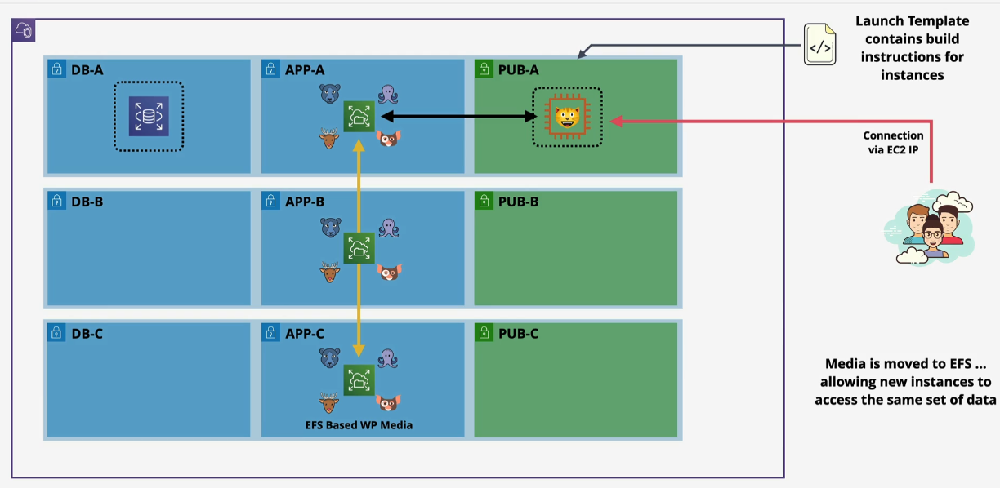
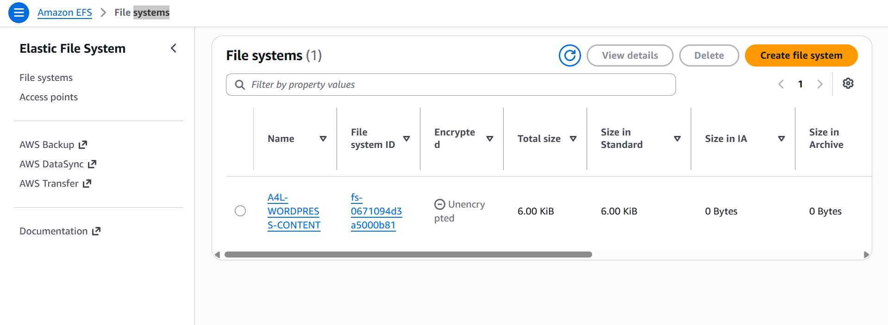

# 📂 Stage 4: Offloading Media to Amazon Elastic File System (EFS)

---

## 📌 Executive Summary

In **Stage 4**, we address file-level state persistence by decoupling the WordPress media assets (`wp-content/uploads`) from the local root EBS volume to **Amazon Elastic File System (EFS)**. While relational database transactions were isolated in Stage 3, uploaded post images and user-generated media remained locked to a single instance.

By offloading static media to a multi-AZ, POSIX-compliant shared file system, newly spawned application instances can read and write to the same shared content directory simultaneously. This satisfies the primary prerequisite for horizontal Auto Scaling and self-healing application fleets.

---

## 🗺️ Architectural Topology

An Amazon EFS file system is provisioned across multiple Availability Zones with mount targets established in each application subnet (`sn-App-A`, `sn-App-B`, and `sn-App-C`). The compute layer mounts the shared volume directly over the network via **NFS** (`TCP/2049`), safeguarded by dedicated Security Groups.



### 🧱 Architectural Highlights

- **Multi-AZ Availability:** EFS mount targets reside across `us-east-1a`, `us-east-1b`, and `us-east-1c`, providing access to the shared file system from multiple Availability Zones.
- **Network-Level Security:** Ingress on `TCP/2049` (NFS) inside `A4LVPC-SGEFS` is tightly scoped to accept traffic only from `A4LVPC-SGWordpress`.
- **Stateless Compute Preparation:** Persistent media is moved away from the local EBS volume, allowing compute instances to be replaced or scaled without losing shared WordPress uploads.

---

## ⚙️ Shared Storage Provisioning

### 1. Amazon EFS Configuration

The managed file system was provisioned with performance and lifecycle settings suited to web asset workloads:

| Parameter | Configuration Value | Architectural Scope |
| :--- | :--- | :--- |
| **File System Name** | `A4L-WORDPRESS-CONTENT` | Centralized WordPress media storage |
| **File System ID** | `fs-0671094d3a5000b81` | Unique EFS resource identifier |
| **Storage Class** | Standard (Multi-AZ) | Shared highly available file storage |
| **Performance / Throughput** | General Purpose / Bursting | Optimized for general web workloads |
| **Lifecycle Management** | Transition to IA after 30 days | Cost optimization for less frequently accessed data |
| **VPC & Mount Subnets** | `A4LVPC` (`sn-App-A`, `sn-App-B`, `sn-App-C`) | Private application-tier network integration |
| **Assigned Security Group** | `A4LVPC-SGEFS` | Enforces NFS least-privilege ingress |



### 2. SSM Parameter Store Integration

To support launch automation and avoid hardcoded filesystem identifiers, the EFS identifier was stored in **AWS Systems Manager Parameter Store**:

| Parameter | Value |
| :--- | :--- |
| **Parameter Name** | `/A4L/Wordpress/EFSFSID` |
| **Tier / Type** | Standard / String |
| **Stored Value** | EFS File System ID / Mount Target DNS identifier |

This allows newly launched EC2 instances to retrieve the required EFS resource dynamically during bootstrap.

---

## 💾 Media Data Migration & Mount Verification

The migration of existing WordPress uploads into the shared file system was executed directly on `Wordpress-LT` through **AWS Systems Manager Session Manager**.

### 1. Package Installation & Temporary Mount

The Amazon EFS utilities package was installed to enable EFS mounting with TLS and IAM authorization:

```bash
# Install EFS helper utilities
sudo dnf -y install amazon-efs-utils

# Query the File System ID from Parameter Store
EFSFSID=$(aws ssm get-parameters \
  --region us-east-1 \
  --names /A4L/Wordpress/EFSFSID \
  --query Parameters[0].Value)

EFSFSID=$(echo "$EFSFSID" | sed -e 's/^"//' -e 's/"$//')
```

### 2. Moving Content & Configuring Persistence

To avoid directory masking when mounting the EFS filesystem, the existing media directory was temporarily moved before creating the mount point:

```bash
# Move existing media out of the mount point
cd /var/www/html/wp-content

sudo mv uploads/ /tmp/

# Recreate the mount point
sudo mkdir -p uploads

# Configure persistent mounting in /etc/fstab
echo "$EFSFSID:/ /var/www/html/wp-content/uploads efs _netdev,tls,iam 0 0" | sudo tee -a /etc/fstab

# Mount all EFS filesystems declared in /etc/fstab
sudo mount -a -t efs

# Restore existing media into the EFS volume
sudo mv /tmp/uploads/* /var/www/html/wp-content/uploads/

# Normalize ownership and permissions
sudo chown -R ec2-user:apache /var/www/html/wp-content/uploads
```

### 3. Mount Validation

The EFS mount was verified using:

```bash
df -hT /var/www/html/wp-content/uploads
```

The mount successfully exposed the shared filesystem through the EFS mount helper, confirming that the WordPress uploads directory was backed by network-based shared storage rather than the local EBS volume.

---

## 🚀 Post-Mount Validation

The compute instance was restarted using:

```bash
sudo reboot
```

The purpose of the reboot was to verify that `/etc/fstab` automatically mounted the EFS filesystem during boot.

After the instance returned to a healthy state, the site was accessed through:

```text
http://18.206.93.123/
```

The homepage and previously uploaded cat photo gallery rendered successfully, confirming that WordPress could read the media assets directly from Amazon EFS after the reboot.

---

## ⚙️ Launch Template Update (v3)

The `Wordpress` Launch Template was updated to **Version 3** to automate the EFS mount process on newly initialized compute nodes.

| Configuration | Value |
| :--- | :--- |
| **Version Description** | `App only, uses EFS filesystem defined in /A4L/Wordpress/EFSFSID` |
| **EFS Utilities** | Added `amazon-efs-utils` |
| **EFS Parameter Retrieval** | Added `/A4L/Wordpress/EFSFSID` lookup |
| **Persistent Mount** | Added `/etc/fstab` EFS configuration |
| **Mount Command** | `mount -a -t efs` |
| **Permissions** | Applied `ec2-user:apache` ownership |
| **Default Version** | **Version 3** |

### User Data Changes

The bootstrap script was updated to:

- Install `amazon-efs-utils`.
- Retrieve the EFS File System ID from SSM Parameter Store.
- Create `/var/www/html/wp-content/uploads`.
- Configure the EFS mount in `/etc/fstab`.
- Mount the EFS filesystem during initialization.
- Apply the required ownership and permissions.

---

## ⚖️ Architectural Audit: Stage 4 Progress

| Architecture Area | State & Progression |
| :--- | :--- |
| **1. Build Process** | ✅ **RESOLVED:** Automated via Launch Template v3 |
| **2. Database Decoupling** | ✅ **RESOLVED:** Managed Amazon RDS MySQL Engine |
| **3. File System Resilience** | ✅ **RESOLVED:** Shared Amazon EFS storage |
| **4. Ingress & Self-Healing** | ❌ **UNRESOLVED:** Direct IP access; no ALB or health-based routing |
| **5. IP Mutability Risk** | ❌ **UNRESOLVED:** WordPress URL references can still depend on the instance IP |

---

## 🎯 Next Milestone: Stage 5 Roadmap

With the database and file system decoupled, the compute layer is now prepared to become **stateless**.

In **Stage 5**, we introduce an **Application Load Balancer (ALB)** and **Auto Scaling Group (ASG)** to provide:

- **Centralized ingress** through a stable application endpoint.
- **Multi-AZ load balancing** across application instances.
- **Health-based instance replacement**.
- **Horizontal scaling** based on demand.
- **Automatic recovery** from unhealthy compute instances.
- Elimination of direct dependency on an individual EC2 public IP address.

The architecture will therefore progress from a **decoupled single-server application** to a **highly available, horizontally scalable WordPress platform**.

---
