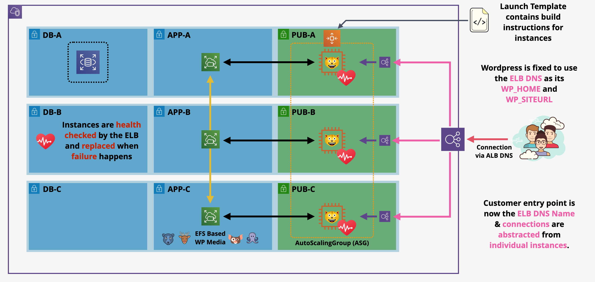
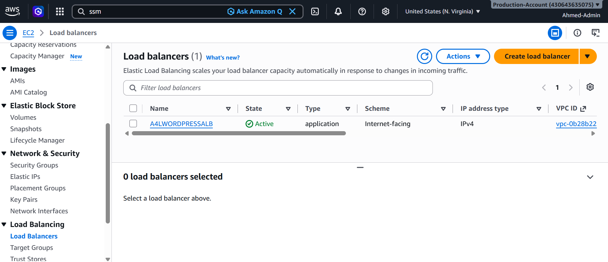
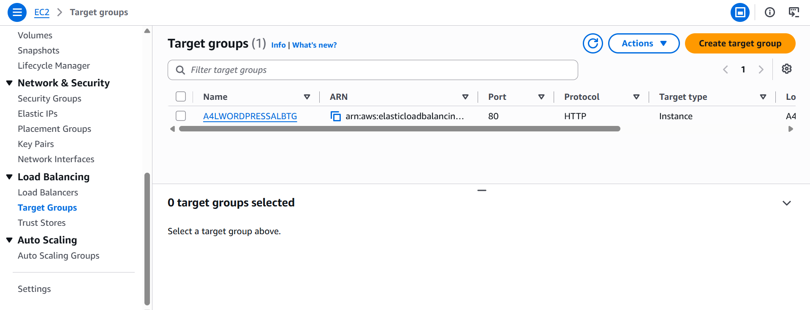
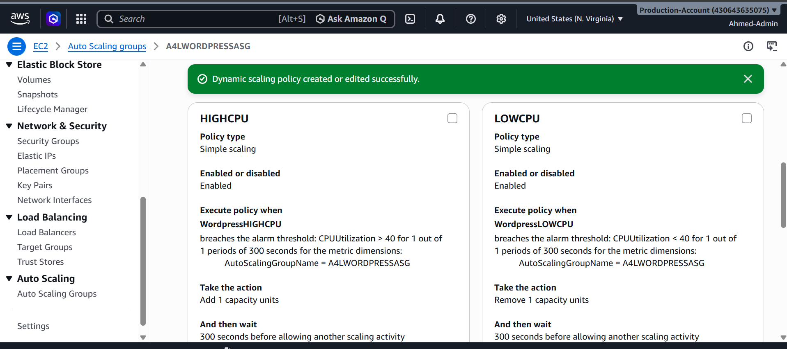

# 🚀 Stage 5: High Availability, Auto Scaling, and Load Balancing

---

## 📌 Executive Summary

In **Stage 5**, we complete the architectural evolution of the WordPress deployment by eliminating the single compute point of failure. With state persistence handled by **Amazon RDS** and static media decoupled to **Amazon EFS**, the EC2 compute layer becomes fully stateless.

We introduce an **Application Load Balancer (ALB)** as the single public entry point and bind it to an **Auto Scaling Group (ASG)** spanning three Availability Zones. This tier handles automatic traffic routing, dynamic instance scaling based on CPU workload, automated health probes, and self-healing fleet restoration.

---

## 🗺️ Architectural Topology

Traffic routes from public consumers through the internet-facing ALB down into scalable compute instances across public subnets, querying decoupled backend tiers across private application and database subnets.




### 🧱 Architectural Highlights

* **Decoupled Ingress:** Inbound requests hit the multi-AZ ALB via a stable DNS name, abstracting instances from public discovery.
* **Elastic Capacity Management:** The ASG scales compute capacity horizontally between 1 and 3 instances using dynamic CloudWatch metric alarms.
* **Automated URL Consistency:** Compute bootstrap routines query the ALB DNS dynamically via SSM Parameter Store, eliminating database IP hardcoding.

---

## ⚖️ Elastic Load Balancing Configuration

### 1. Application Load Balancer Provisioning

An internet-facing Application Load Balancer was provisioned across the three public subnets in `A4LVPC`:

| Parameter                  | Configuration Value                           | Architectural Scope                      |
| :------------------------- | :-------------------------------------------- | :--------------------------------------- |
| **Load Balancer Name**     | `A4LWORDPRESSALB`                             | Public HTTP traffic entry point          |
| **Scheme / IP Addressing** | Internet-facing / IPv4                        | Public web ingress                       |
| **VPC & Subnet Mapping**   | `A4LVPC` (`sn-pub-A`, `sn-pub-B`, `sn-pub-C`) | Multi-AZ edge availability               |
| **Security Group**         | `A4LVPC-SGLoadBalancer`                       | Inbound HTTP (`tcp/80`) from `0.0.0.0/0` |
| **Listeners**              | HTTP:80 forwarding to `A4LWORDPRESSALBTG`     | Application traffic ingestion            |



### 2. Target Group Configuration

A dedicated target group was established to manage health monitoring and instance registration:

* **Target Group Name:** `A4LWORDPRESSALBTG`
* **Target Type:** Instance
* **Protocol & Port:** HTTP / 80
* **Health Check Path & Status Codes:** `/` with success codes `200,301,302`



### 3. Storing the ALB DNS in Parameter Store

The generated ALB DNS name was persisted to **AWS Systems Manager Parameter Store** so newly bootstrapped instances can discover their entry endpoint at runtime:

* **Parameter Name:** `/A4L/Wordpress/ALBDNSNAME`
* **Tier & Type:** Standard / String
* **Value:** `A4LWORDPRESSALB-xxxx.elb.amazonaws.com`


---

## ⚙️ Launch Template Automation & URL Synchronization

The Launch Template was updated to automate the replacement of stale IP addresses inside the RDS database with the ALB DNS name.

### 1. Database URL Replacement Script

An initialization script (`/home/ec2-user/update_wp_ip.sh`) was added to User Data to run on boot:

```bash
#!/bin/bash
source <(php -r 'require("/var/www/html/wp-config.php"); echo("DB_NAME=".DB_NAME."; DB_USER=".DB_USER."; DB_PASSWORD=".DB_PASSWORD."; DB_HOST=".DB_HOST); ')
SQL_COMMAND="mysql -u $DB_USER -h$DB_HOST -p$DB_PASSWORD$DB_NAME -e"
OLD_URL=$(mysql -u $DB_USER -h$DB_HOST -p$DB_PASSWORD$DB_NAME -e 'select option_value from wp_options where option_name = "siteurl";' | grep http)

ALBDNSNAME=$(aws ssm get-parameters --region us-east-1 --names /A4L/Wordpress/ALBDNSNAME --query Parameters[0].Value | sed -e 's/^"//' -e 's/"$//')

if [ -n "$OLD_URL" ] && [ -n "$ALBDNSNAME" ]; then
  $SQL_COMMAND "UPDATE wp_options SET option_value = replace(option_value, '$OLD_URL', 'http://$ALBDNSNAME') WHERE option_name = 'home' OR option_name = 'siteurl';"
  $SQL_COMMAND "UPDATE wp_posts SET guid = replace(guid, '$OLD_URL','http://$ALBDNSNAME');"
  $SQL_COMMAND "UPDATE wp_posts SET post_content = replace(post_content, '$OLD_URL','http://$ALBDNSNAME');"
  $SQL_COMMAND "UPDATE wp_postmeta SET meta_value = replace(meta_value,'$OLD_URL','http://$ALBDNSNAME');"
fi
```

### 2. Template Versioning

The template was finalized, and default configurations were verified for instance rollout.

---

## 📈 Auto Scaling Group (ASG) Deployment & Self-Healing

### 1. ASG Configuration

An Auto Scaling Group was created and bound to the Target Group:

* **ASG Name:** `A4LWORDPRESSASG`
* **Network Integration:** `A4LVPC` across subnets `sn-Pub-A`, `sn-Pub-B`, and `sn-Pub-C`
* **Target Attachments:** `A4LWORDPRESSALBTG`
* **Capacity Settings:** Desired: `1` | Min: `1` | Max: `3`


### 2. Fleet Rotation & Self-Healing Test

The legacy standalone instance `Wordpress-LT` was manually terminated.


The ASG detected a capacity deficit (`0` running vs `1` desired) and provisioned a new node, `Wordpress-ASG`, verifying automated instance recovery.


---

## 📊 Dynamic Scaling Policies via CloudWatch

To scale horizontally under load and contract during off-peak windows, two dynamic Simple Scaling policies were configured using CloudWatch metric alarms:

1. **WordpressHIGHCPU:** Triggers when average `CPUUtilization > 40%`. Action: **Add 1 capacity unit**.
2. **WordpressLOWCPU:** Triggers when average `CPUUtilization < 40%`. Action: **Remove 1 capacity unit**.


Both alarms were connected to the corresponding scaling policies in the ASG configuration.



---

## ⚖️ Architectural Audit: Evolution Summary

| Architecture Limitation             | Evolution State Across Stages                       |
| :---------------------------------- | :-------------------------------------------------- |
| **1. Manual Server Configuration**  | ✅ **FIXED:** Fully automated Launch Template build  |
| **2. Local Database Coupling**      | ✅ **FIXED:** Migrated to Amazon RDS Multi-AZ MySQL  |
| **3. Local Media Store Loss**       | ✅ **FIXED:** Shared Multi-AZ Amazon EFS mount       |
| **4. Direct Public IP Dependency**  | ✅ **FIXED:** Managed ALB DNS Entry Endpoint         |
| **5. Static Scale & Failure Risks** | ✅ **FIXED:** Self-healing ASG with CloudWatch Alarm |
| **6. Hardcoded Database URLs**      | ✅ **FIXED:** Dynamic SSM & bash search/replace      |

---

